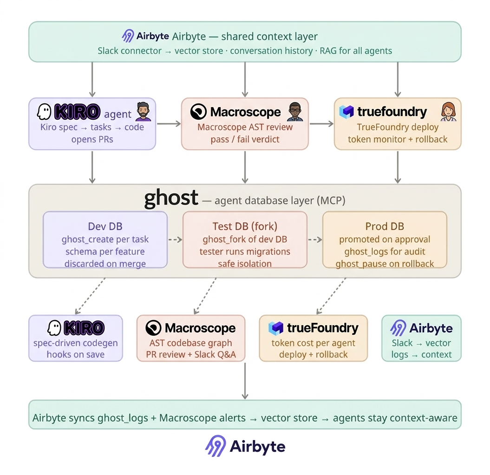

# Shipify

**Your engineering team, fully autonomous.**

Spec in. Secured. Shipped. No standups.

Built at the Deep Agents Hackathon · RSAC 2026 — Shipify is a three-agent AI system that takes a natural-language product spec and ships production-ready, security-reviewed, deployed code entirely on its own. All agents run on OpenClaw.

[**→ Demo site**](https://manufz.github.io/RSAC-march27-hackathon/shipify-marketing.html)

---

## Architecture



Airbyte sits at the top as a shared context layer — it syncs Slack conversations and decisions into a vector store (Pinecone), giving all three agents persistent RAG memory. Below that, three agents run in sequence:

- **Sean (Kiro)** — takes the spec, generates a design doc and task queue via the Kiro CLI, writes the code, and opens a PR
- **Christopher (Macroscope)** — forks the dev DB, runs a full AST scan on the PR via Macroscope's Slack integration, and either approves or blocks with specific issues
- **Amy (TrueFoundry)** — promotes the tested DB fork to production, deploys via TrueFoundry, polls health checks, and rolls back instantly via `ghost_pause` if anything fails

Ghost.build is the database layer underneath all three agents — each gets an isolated Postgres DB that follows its own lifecycle: created per task, forked for testing, promoted to prod on approval.

---

## The three agents

| Agent | Persona | Powered by |
|---|---|---|
| Sean | Developer — methodical, ships PRs while you sleep | Kiro, Ghost.build |
| Christopher | Cybersec / Pentester — red-teams every PR before merge | Macroscope AST |
| Amy | Deployment — zero downtime, zero drama | TrueFoundry, Ghost.build |

---

## Tech stack

| Tool | Role in Shipify |
|---|---|
| **Kiro** | Spec-driven codegen — prompt → spec → design → tasks → code, hooks fire on every file save |
| **Macroscope** | AST-based PR review — builds a graph of the codebase, finds hard-to-detect bugs, answers Slack questions grounded in actual code |
| **TrueFoundry** | Deployment + agent gateway — monitors latency, error rates, token spend per agent, enforces cost budgets in real time |
| **Ghost.build** | Agent database layer (MCP) — `ghost_create`, `ghost_fork`, `ghost_promote`, `ghost_pause` give each agent full DB lifecycle control |
| **Airbyte** | Context storage — 600+ connectors pull Slack history and pipe it into a vector store so all agents share persistent memory |

---

## Project structure

```
shipify/
├── main.py                    # CLI entry point
├── config.py                  # All env vars
├── orchestrator/pipeline.py   # Sean → Christopher → Amy loop
├── agents/
│   ├── developer.py           # Kiro: spec → tasks → code → PR
│   ├── tester.py              # Macroscope via Slack: AST review
│   └── deployer.py            # TrueFoundry: deploy + rollback
├── db/ghost.py                # Ghost MCP wrapper
├── context/airbyte.py         # Airbyte sync + Pinecone RAG
└── gateway/truefoundry.py     # Token tracking + budget enforcement
```

---

## Quickstart

```bash
git clone https://github.com/manufz/RSAC-march27-hackathon
cd RSAC-march27-hackathon

pip install -r requirements.txt
cp .env.example .env   # fill in your API keys

python -m shipify.main "Add OAuth2 login with Google" --version 1.4.0
```

The pipeline prints live status from each agent and a per-agent spend report at the end (visible in the TrueFoundry dashboard).

---

*Built at Deep Agents Hackathon · RSAC 2026 · Running on OpenClaw*
